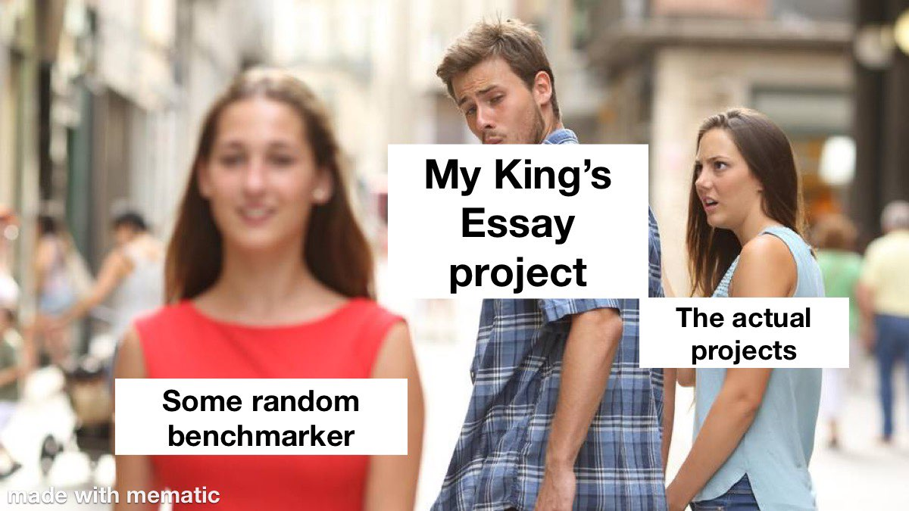

# KingsEssayProjects

As part of a school project, I wanted to create the same project in lots of different languages in order to analyse how the different languages performed as well as devevloper experience.

I also created a benchmarker to analyse them, but once the benchmarker crossed about 1500 LOC, the benchmarker became the project.

For the sake of the work I put into them, I've left them here.

